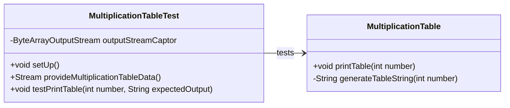

# 🥷 **Loop Drill: Multiplication Table**

A Java exercise that generates the multiplication table for a given integer. This exercise was developed focusing on the application of core software engineering principles like Test-Driven Development ([TDD](https://en.wikipedia.org/wiki/Test-driven_development)), Git best practices, and Java code coverage ([JaCoCo](https://en.wikipedia.org/wiki/Java_code_coverage_tools)).

## 🚀 **Technologies Used**

* **Java 21**: The primary programming language used for this exercise.
* **Maven**: A build automation tool used to manage dependencies and lifecycle.
* **JUnit 5**: The testing framework used for writing and running unit tests.
* **Hamcrest**: A library of matcher objects that can be combined to create flexible and readable assertions in tests.
* **Git & GitHub**: Version control system and hosting platform used to manage the exercise's codebase.
* **Visual Studio Code and IntelliJ IDEA**: These are the integrated development environments (IDEs) used for development.

## ✨ **Features & Requirements**

This exercise includes:

* A class responsible for creating the multiplication table for a number.
* ```printTable``` method that generates and prints the multiplication table from 1 to 10 for a given ```integer number```.
* A unit test suite with at least **80% coverage**, ensuring all code paths are thoroughly validated.

## 🧠 **Key Learnings & Concepts**

* **Test-Driven Development (TDD)**: A development workflow focused on writing a failing test first (Red), writing the minimal code to pass the test (Green), and then improving the code (Refactor).

* **Git Branching**: The use of ```feature```, ```development```, and ```release``` branches to manage changes and maintain a stable main branch.

* **Separation of Concerns**: Refactoring code to separate distinct responsibilities, such as generating a string from the action of printing it. This makes the code more modular and testable.

* **StringBuilder**: A more efficient and performant alternative to standard string concatenation within loops.

* **Platform Independence**: Using ```System.lineSeparator()``` instead of hardcoding ```\n``` to ensure the application behaves correctly across different operating systems.

* **Parameterized Tests**: Using JUnit 5's ```@ParameterizedTest``` and ```@MethodSource``` to run the same test with different data inputs, which reduces code duplication and improves test readability.

* **Java Reflection**: A powerful tool used to inspect and manipulate classes, methods, and fields at runtime. In this exercise, it was used to test a private method.

* **Code Coverage**: Using tools like [JaCoCo](https://en.wikipedia.org/wiki/Java_code_coverage_tools) to measure the percentage of code that is executed by tests, which helps ensure high-quality and reliable code.

## 📝 **Class Diagrams**

Here is a class diagram for the MultiplicationTable class and its test suite.



## 🗺️ **How to Use**

This project is built with Maven, which handles all dependencies. To run the tests and generate the code coverage report, simply execute the following command in your terminal:

```shell
mvn clean verify
```

This will compile the code, run all unit tests, and produce a [JaCoCo](https://en.wikipedia.org/wiki/Java_code_coverage_tools) coverage report in the ```target/site/jacoco``` directory, named ```index.html```.

## ✅ TDD Coverage

This section contains a screenshot of the test coverage report,
demonstrating that every method has been thoroughly tested.&nbsp;


## ℹ️ About

This project is part of the [Full Stack Web Development training program](https://factoriaf5.org/aprende/desarrollo-web-full-stack-asturias/) in [Asturias](https://en.wikipedia.org/wiki/Asturias), offered by [Factoría F5](https://factoriaf5.org/).

The curriculum covers a wide range of topics, from basic programming languages ​​and UX principles to advanced project development techniques. It includes front-end and back-end technologies, agile methodologies, and tools for user experience design and database development. The program also focuses on essential soft skills such as communication, problem-solving, teamwork, adaptability, and time management.

## 📧 Contact

For any questions or inquiries, please do not hesitate to contact me!

Happy coding! 🌱 🐒
